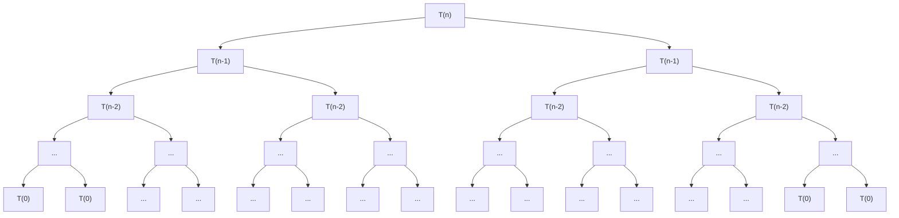

# Notes

#### Problem 1

```
T(n) {
  if (n > 0) {
    // O(1)
    T(n-1)
    T(n-1)
  }
}
```

O(2^n)

Back Substitution

$$
\begin{aligned}
T(n) &= T(n-1) + T(n-1) + 1 \\
T(n) &= 2T(n-1) + 1 \\
T(n) &= 2(2T(n-2) + 1) + 1 \\
T(n) &= 2^2T(n-2) + 2 + 1 \\
T(n) &= 2^2(2T(n-3) + 1) + 2 + 1 \\
T(n) &= 2^3T(n-3) + 2^2 + 2 + 1 \\
T(n) &= 2^3(2T(n-4) + 1) + 2^2 + 2 + 1 \\
T(n) &= 2^4T(n-4) + 2^3 + 2^2 + 2 + 1 \\
T(n) &= 2^kT(n-k) + 2^{k-1} + 2^{k-2} + ... + 2^2 + 2 + 1 & \text{(Pattern Emerges)} \\
T(n) &= 2^kT(n-k) + \sum_{i=0}^{k-1} 2^i \\
T(n) &= 2^kT(n-k) + \frac{2^k - 1}{2 - 1} \\
T(n) &= 2^kT(n-k) + 2^k - 1 \\
T(n) &= 2^k(T(n-k) + 1) - 1 \\
T(n) &= 2^n(T(n-n) + 1) - 1 \\
T(n) &= 2^nT(0) + 2^n - 1 \\
T(n) &= 2^n + 2^n - 1 \\
T(n) &= 2^{n+1} - 1 \\
T(n) &= O(2^n) \\
\end{aligned}
$$

Recursion Tree



#### Problem 2: Binary Search

```
T(n) {
  if (n > 0) {
    // O(1)
    T(n/2)
  }
}
```

Given:

$$
\begin{aligned}
T(n) &= \begin{dcases}
  n > 0 \implies T(n/2) + C \\
  n = 0 \implies C \\
\end{dcases} \\
\end{aligned}
$$

Back Substitution:

$$
\begin{aligned}
T(n) &= T(n/2) + C \\
T(n) &= T(n/4) + C + C \\
T(n) &= T(n/8) + C + C + C \\
T(n) &= T(n/2^3) + 3 * C \\
T(n) &= T(n/2^k) + Ck \\
T(n) &= T(1) + C\log_2(n) \\
T(n) &= C\log_2(n) \\
T(n) &= O(\log_2(n)) \\
\end{aligned}
$$

#### Problem 3

Consider a set of 13 elements in an array list the elements of array that require largest number of key comparisons when searched using binary search. Find the average number of key comparisons required in successful and unsuccessful searches.

