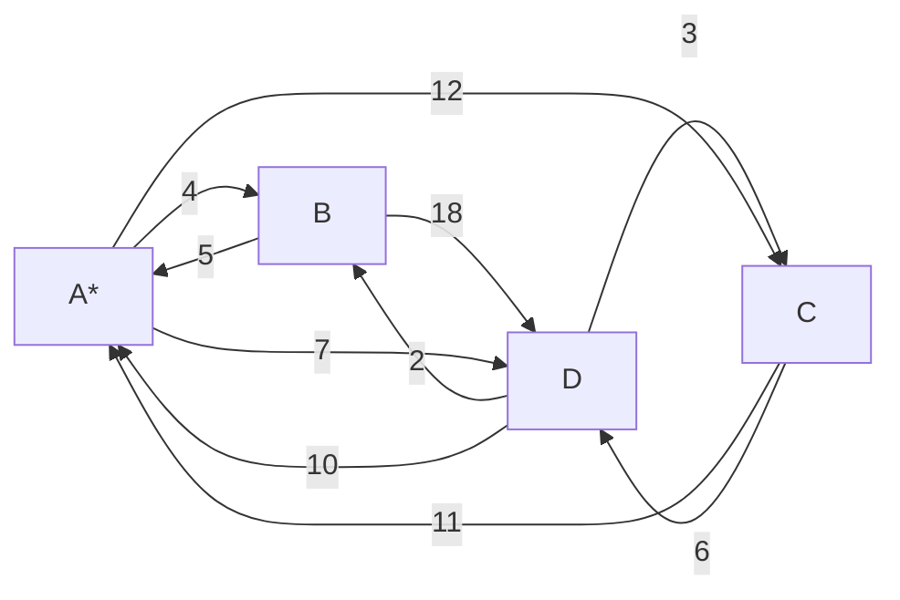
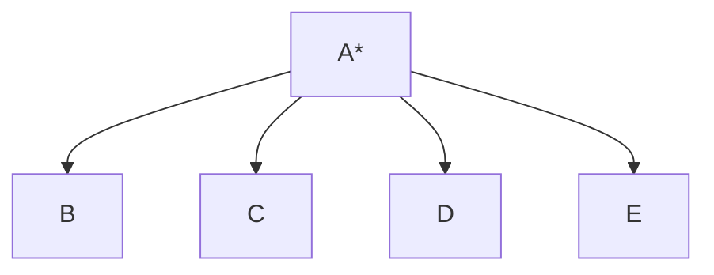
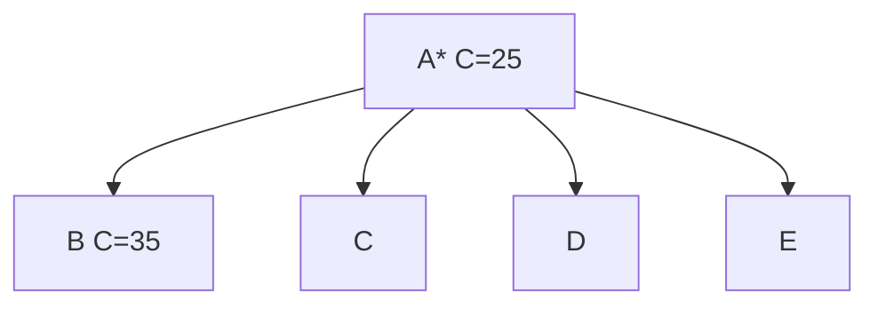

# Branch and Bound

Branch and bound is a general algorithm for finding optimal solutions of optimization problems, especially in discrete and combinatorial optimization. It is a divide and conquer algorithm, which recursively divides the problem into smaller subproblems, and then combines the solutions to the subproblems to form a solution to the original problem. The algorithm is a generalization of the branch and bound algorithm for integer programming.

## Search Strategies

- Depth-first search
- Breadth-first search
- Best-first search
- Branch and bound
- A\* search
- Iterative deepening depth-first search
- Branch and cut
- Branch and price

## Traveling Salesman Problem using Branch and Bound

The traveling salesman problem is the problem of finding the shortest route that visits all the cities in a given set. The problem is NP-complete.

**Solution using Branch and Bound**

Given the following graph:

and the following cost matrix:

$$
\begin{aligned}
C = \begin{array}{c|c c c c}
  & \text{A} & \text{B} & \text{C} & \text{D} \\ \hline
  \text{A} & \infty & 4 & 12 & 7 \\
  \text{B} & 5 & \infty & \infty & 18 \\
  \text{C} & 11 & \infty & \infty & 6 \\
  \text{D} & 10 & 2 & 3 & \infty \\
\end{array}
\end{aligned}
$$

1. Subtract the minimum value of each row and column from the corresponding row and column to find the reduced cost matrix.

$$
\begin{aligned}
C_1 &= \begin{array}{c|c c c c|c}
  & \text{A} & \text{B} & \text{C} & \text{D} & \text{min} \\ \hline
  \text{A} & \infty & 4 & 12 & 7 & 4 \\
  \text{B} & 5 & \infty & \infty & 18 & 5 \\
  \text{C} & 11 & \infty & \infty & 6 & 6 \\
  \text{D} & 10 & 2 & 3 & \infty & 2 \\
\end{array} \\ \\
&= \begin{array}{c|c c c c}
  & \text{A} & \text{B} & \text{C} & \text{D}  \\ \hline
  \text{A} & \infty & 0 & 8 & 3 \\
  \text{B} & 0 & \infty & \infty & 13 \\
  \text{C} & 5 & \infty & \infty & 0 \\
  \text{D} & 8 & 0 & 1 & \infty \\ \hline
  \text{min} & 0 & 0 & 1 & 0 \\
\end{array} \\ \\
&= \begin{array}{c|c c c c}
  & \text{A} & \text{B} & \text{C} & \text{D} \\ \hline
  \text{A} & \infty & 0 & 7 & 3 \\
  \text{B} & 0 & \infty & \infty & 13 \\
  \text{C} & 5 & \infty & \infty & 0 \\
  \text{D} & 8 & 0 & 0 & \infty \\
  \end{array}
\end{aligned}
$$

1. Find cost of each edge. Stating from A, we get the following costs:

$$

\begin{aligned}
C_2 = \begin{array}{c|c c c c c}
& \text{A} & \text{B} & \text{C} & \text{D} & \text{E} \\ \hline
\text{A} & \infty & \infty & \infty & \infty & \infty \\
\text{B} & \infty & \infty & 11 & 2 & 0 \\
\text{C} & 0 & \infty & \infty & 0 & 2 \\
\text{D} & 15 & \infty & 12 & \infty & 0 \\
\text{E} & 11 & \infty & 0 & 12 & \infty \\
\end{array}
\end{aligned}

$$

$$

\begin{aligned}
C(A,B) &= C_1(A,B) + r + \^{r} \\
&= 10 + 0 + 25 = 35
\end{aligned}

$$

### Task Schedule Problem

The task scheduling problem is the problem of scheduling a set of tasks on a set of resources while minimizing the total execution time. The problem is NP-complete.

**Solution using FIFO Branch and Bound**

The FIFO branch and bound algorithm is a branch and bound algorithm that uses a FIFO queue to store the nodes of the search tree. The algorithm is a generalization of the FIFO branch and bound algorithm for integer programming.
$$
