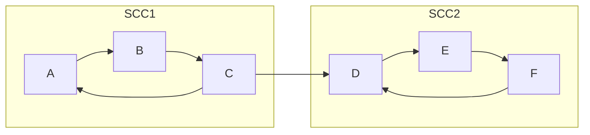
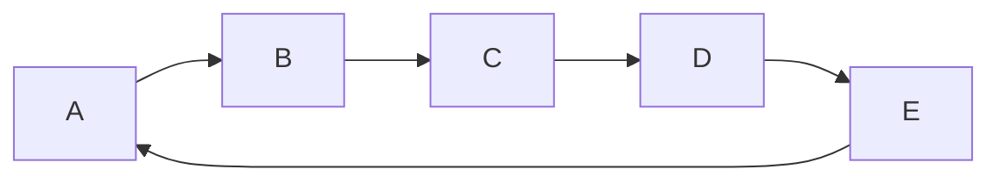

# Breadth First Search

Breadth First Search (BFS) is a graph traversal algorithm that explores vertices in the order of their distance from the source vertex, where distance is the minimum length of a path from source vertex to the node as evident from above example.

BFS explores vertices in increasing order of their distance from the source vertex. So, it is used when we search for a path between two specific nodes.

BFS is a traversing algorithm where you should start traversing from a selected node (source or starting node) and traverse the graph layerwise thus exploring the neighbour nodes (nodes which are directly connected to source node). You must then move towards the next-level neighbour nodes.

## Algorithm

```py
def bfs(graph, start):
  visited = set()
  queue = deque([start])
  while queue:
    vertex = queue.popleft()
    if vertex not in visited:
      visited.add(vertex)
      queue.extend(graph[vertex] - visited)
  return visited
```

## Graph Coloring

Graph coloring is a way of coloring the vertices of a graph such that no two adjacent vertices share the same color. A graph coloring is a proper coloring of the graph where no two adjacent vertices are colored with the same color. A graph coloring is a proper k-coloring if k colors are used.

### Bipartite Graph

A bipartite graph is a graph whose vertices can be divided into two disjoint sets so that every edge connects two vertices from different sets. A bipartite graph is possible if the graph coloring is possible using two colors such that vertices in a set are colored with the same color.

### Algorithm

```py
class Graph:
  def __init__(self, vertices):
    self.V = vertices
    self.graph = [[0 for column in range(vertices)] for row in range(vertices)]

  def isBipartite(self, src):
    colorArr = [-1] * self.V
    colorArr[src] = 1
    queue = []
    queue.append(src)
    while queue:
      u = queue.pop()
      if self.graph[u][u] == 1:
        return False
      for v in range(self.V):
        if self.graph[u][v] == 1 and colorArr[v] == -1:
          colorArr[v] = 1 - colorArr[u]
          queue.append(v)
        elif self.graph[u][v] == 1 and colorArr[v] == colorArr[u]:
          return False
    return True

g = Graph(4)
g.graph = [[0, 1, 0, 1],
           [1, 0, 1, 0],
           [0, 1, 0, 1],
           [1, 0, 1, 0]]

print("Yes" if g.isBipartite(0) else "No") # Yes
```

# Depth First Search

Depth First Search (DFS) is a graph traversal algorithm that explores vertices in the order of their distance from the source vertex, where distance is the minimum length of a path from source vertex to the node as evident from above example.

DFS explores vertices in increasing order of their distance from the source vertex. So, it is used when we search for a path between two specific nodes.

DFS is a traversing algorithm where you should start traversing from a selected node (source or starting node) and traverse the graph layerwise thus exploring the neighbour nodes (nodes which are directly connected to source node). You must then move towards the next-level neighbour nodes.

## Algorithm

```py
def dfs(graph, start, visited=None):
  if visited is None:
    visited = set()
  visited.add(start)
  for next in graph[start] - visited:
    dfs(graph, next, visited)
  return visited
```

# Comparison

<table>

<thead>
<tr>
<th> </th>
<th>Breadth First Search</th>
<th>Depth First Search</th>
</tr>
</thead>

<tbody>

<tr>
<th>Alogrithm</th>
<td>

```py
def bfs(graph, start):
  visited = set()
  queue = deque([start])
  while queue:
    vertex = queue.popleft()
    if vertex not in visited:
      visited.add(vertex)
      queue.extend(graph[vertex] - visited)
  return visited
```

</td>
<td>

```py
def dfs(graph, start, visited=None):
  if visited is None:
    visited = set()
  visited.add(start)
  for next in graph[start] - visited:
    dfs(graph, next, visited)
  return visited
```

</td>
</tr>

<tr>
<th>Time Complexity</th>
<td>

$O(V+E)$

</td>
<td>

$O(V+E)$

</td>
</tr>

<tr>
<th>Space Complexity</th>
<td>

$O(V)$

</td>
<td>

$O(V)$

</td>
</tr>

<tr>
<th>Applications</th>
<td>

- Shortest path in an unweighted graph
- Peer to peer networks
- Crawlers in search engines
- Social networking websites
- GPS navigation systems
- Broadcasting in Network

</td>
<td>

- Topological Sorting
- Solving puzzles with only one solution, such as mazes
- Finding strongly connected components of a graph
- Finding bridges and articulation points in a graph
- Finding strongly connected components
- Finding biconnected components

</td>
</tr>

</tbody>
</table>

# Connected Components

A connected component of an undirected graph is a subgraph in which every two vertices are connected to each other by a path(s), and which is connected to no other vertices outside the subgraph.

## Algorithm

```py
def connected_components(graph):
  visited = set()
  components = []
  for vertex in graph:
    if vertex not in visited:
      component = dfs(graph, vertex)
      visited.update(component)
      components.append(component)
  return components
```

## Strongly Connected Components

A directed graph is strongly connected if there is a path between all pairs of vertices. A strongly connected component (SCC) of a directed graph is a maximal strongly connected subgraph. For example, there are 3 SCCs in the following graph:



Strongly Connected Components: $\{A, B, C\}$ and $\{D, E, F\}$

# Hamiltonian Cycles

A Hamiltonian cycle (or Hamiltonian circuit) is a Hamiltonian path that is a cycle. Determining whether such paths and cycles exist in graphs is the Hamiltonian path problem, which is NP-complete.

Example:



## Finding Hamiltonian Cycles using Depth First Search

```py
def hamiltonian_cycle(graph):
  start = next(iter(graph))
  path = [start]
  visited = set()
  visited.add(start)
  if dfs(graph, start, visited, path):
    return path
  return None

def dfs(graph, start, visited, path):
  if len(visited) == len(graph):
    return True
  for next in graph[start] - visited:
    visited.add(next)
    path.append(next)
    if dfs(graph, next, visited, path):
      return True
    visited.remove(next)
    path.pop()
  return False
```

