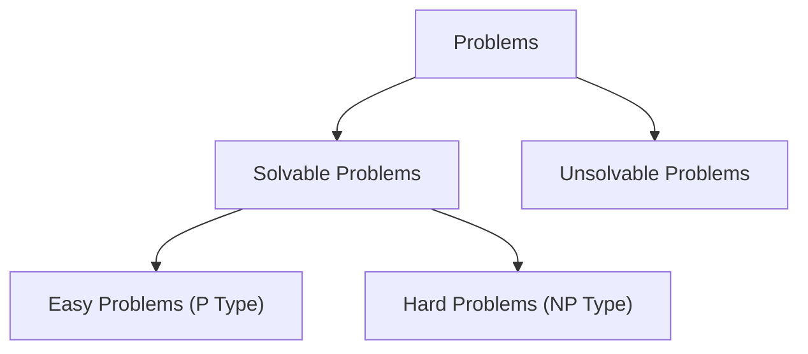

# Computation Complexity

## Decision Problem vs Optimization Problem

| Problem Type | Decision Problem                        | Optimization Problem                                                                 |
| ------------ | --------------------------------------- | ------------------------------------------------------------------------------------ |
| Definition   | A problem that requires a yes/no answer | A problem that requires a solution that maximizes or minimizes an objective function |
| Example      | Is there a path from node A to node B?  | What is the shortest path from node A to node B?                                     |
| Complexity   | P, NP, NP-Complete, NP-Hard             | P, NP, NP-Complete, NP-Hard                                                          |

## Tractable vs Intractable Problems

| Problem Type | Tractable Problem                               | Intractable Problem                                |
| ------------ | ----------------------------------------------- | -------------------------------------------------- |
| Definition   | A problem that can be solved in polynomial time | A problem that cannot be solved in polynomial time |
| Example      | Sorting, Shortest Path, Minimum Spanning Tree   | Traveling Salesman Problem, Knapsack Problem       |
| Complexity   | P                                               | NP, NP-Complete, NP-Hard                           |

## Polynomial Time vs Exponential Time

| Problem Type | Polynomial Time Problem                         | Exponential Time Problem                         |
| ------------ | ----------------------------------------------- | ------------------------------------------------ |
| Definition   | A problem that can be solved in polynomial time | A problem that can be solved in exponential time |
| Example      | Sorting, Shortest Path, Minimum Spanning Tree   | Traveling Salesman Problem, Knapsack Problem     |
| Complexity   | P                                               | NP, NP-Complete, NP-Hard                         |

## Class of Problems

## P vs NP vs NP-Hard vs NP-Complete

- P (Polynomial Time): A problem that can be solved in polynomial time
  Examples: Sorting, Shortest Path, Minimum Spanning Tree
- NP (Nondeterministic Polynomial Time): A problem that can be verified in polynomial time
  Examples: 0/1 Knapsack Problem, Traveling Salesman Problem

  - NP-Hard: A problem that is at least as hard as the hardest problems in NP
    Examples: Traveling Salesman Problem, Knapsack Problem
  - NP-Complete: A problem that is in NP and is NP-Hard
    Examples: 0/1 Knapsack Problem, Traveling Salesman Problem

## CNF Satisfiability Problem

Given a logical expression in conjunctive normal form (CNF), is there a way to assign truth values to the variables so that the entire expression is true?

Example:

$$
\phi = (x_1 \lor \lnot x_2 \lor x_3) \land (\lnot x_1 \lor x_2 \lor \lnot x_3)
$$

For what values of $x_1$, $x_2$, and $x_3$ is $\phi$ true?