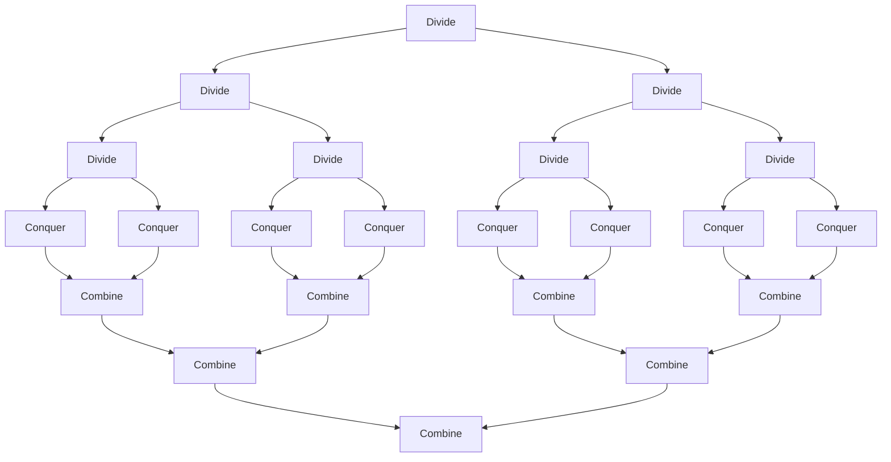
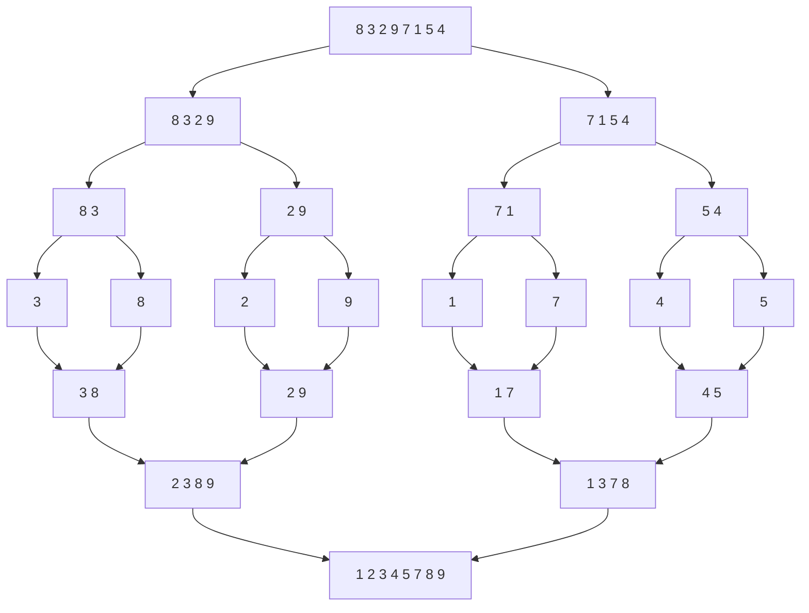
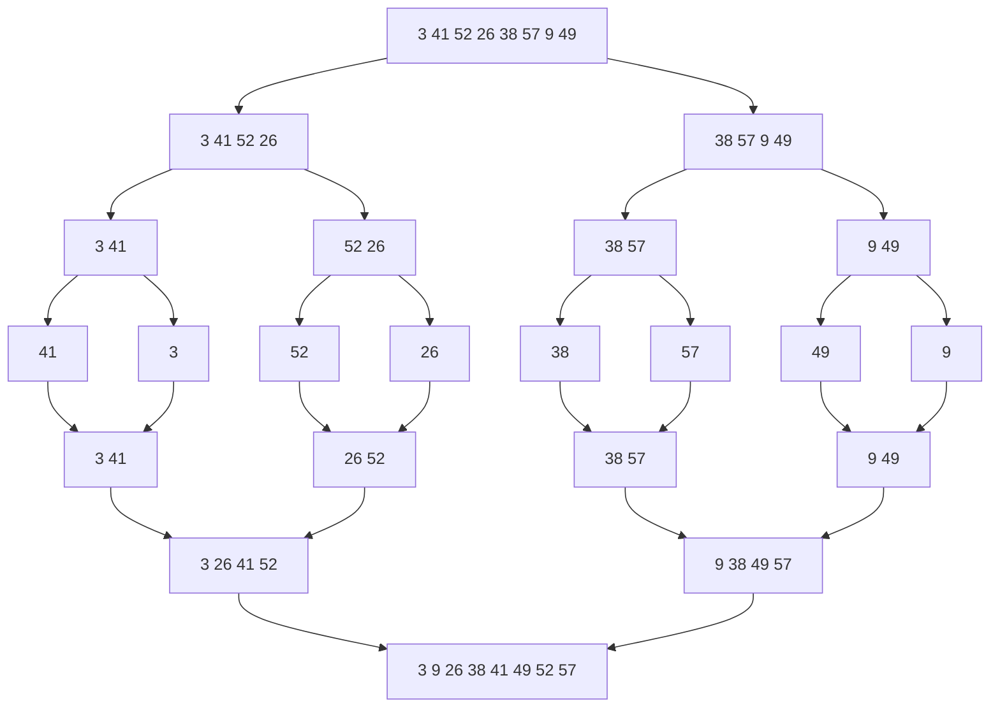
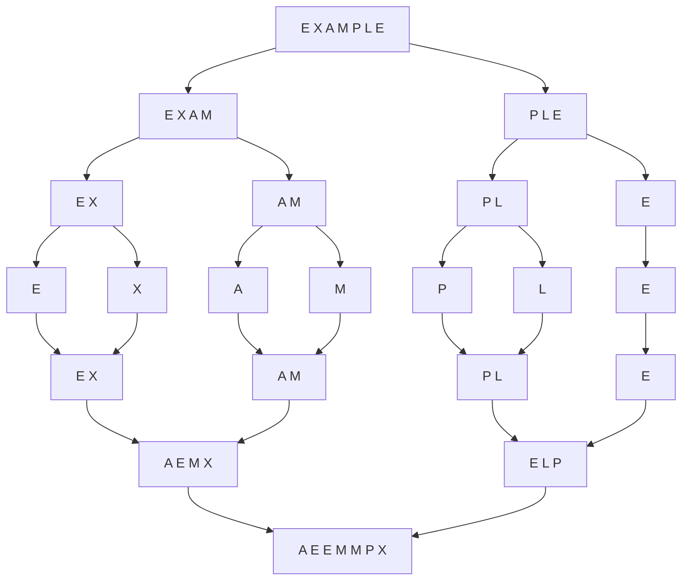

# Divide and Conquer



## Applications

- Searching
  - Binary Search
- Sorting
  - Merge Sort
  - Quick Sort

## Sorting

### Merge Sort

Merge Sort is a Divide and Conquer algorithm. It divides input array in two halves, calls itself for the two halves and then merges the two sorted halves. The merge() function is used for merging two halves. The merge(arr, l, m, r) is key process that assumes that arr[l..m] and arr[m+1..r] are sorted and merges the two sorted sub-arrays into one.

```cpp
void merge(int arr[], int l, int m, int r) {
    int i, j, k;
    int n1 = m - l + 1;
    int n2 = r - m;

    /* create temp arrays */
    int L[n1], R[n2];

    /* Copy data to temp arrays L[] and R[] */
    for (i = 0; i < n1; i++) L[i] = arr[l + i];
    for (j = 0; j < n2; j++) R[j] = arr[m + 1 + j];

    /* Merge the temp arrays back into arr[l..r]*/
    i = 0; // Initial index of first subarray
    j = 0; // Initial index of second subarray
    k = l; // Initial index of merged subarray

    while (i < n1 && j < n2) { // As long as both L and R have elements
        if (L[i] <= R[j]) { // If L[i] is smaller than R[j]
            arr[k] = L[i]; // Copy L[i] to arr[k]
            i++; // Next element in L
        } else {
            arr[k] = R[j]; // Copy R[j] to arr[k]
            j++; // Next element in R
        }
        k++; // Next element in arr
    }

    /* Copy the remaining elements of L[], if there are any */
    while (i < n1) { // As long as L has elements
        arr[k] = L[i]; // Copy L[i] to arr[k]
        i++; // Next element in L
        k++; // Next element in arr
    }

    /* Copy the remaining elements of R[], if there are any */
    while (j < n2) { // As long as R has elements
        arr[k] = R[j]; // Copy R[j] to arr[k]
        j++; // Next element in R
        k++; // Next element in arr
    }
}

void merge_sort(int arr[], int l, int r) {
    if (l < r) { // As long as l < r
        int m = l + (r - l) / 2; // Find the middle point

        merge_sort(arr, l, m); // Sort first half
        merge_sort(arr, m + 1, r); // Sort second half

        merge(arr, l, m, r); // Merge the sorted halves
    }
}
```

Complexity:

$$
\begin{aligned}
T(n) = aT(\frac{n}{b}) + C(n) + D(n)
&= 2T(\frac{n}{2}) + \theta(n) \\
&= 2(2T(\frac{n}{4}) + \theta(\frac{n}{2})) + \theta(n) \\
&= 2^2T(\frac{n}{2^2}) + 2\theta(n) \\
&= 2^2(2T(\frac{n}{2^3}) + \theta(\frac{n}{2^2})) + 2\theta(n) \\
&= 2^3T(\frac{n}{2^3}) + 3\theta(n) \\
&= 2^kT(\frac{n}{2^k}) + k\theta(n) \\
&= 2^{\log_2 n}T(\frac{n}{2^{\log_2 n}}) + \log_2 n\theta(n) \\
&= nT(1) + n\theta(\log_2 n) \\
&= n\theta(\log_2 n) \\
&= \theta(n\log_2 n) \\
\end{aligned}
$$

Example:



Question: Illustrate the operation of merge sort on the array A = {3, 41, 52, 26, 38, 57, 9, 49}.



Question: IApply merge sort to sort the list E X A M P L E in alphabetical order.


