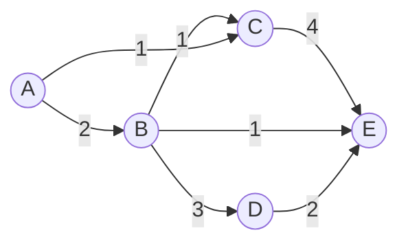
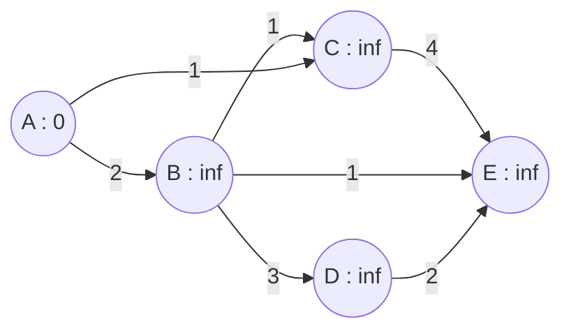
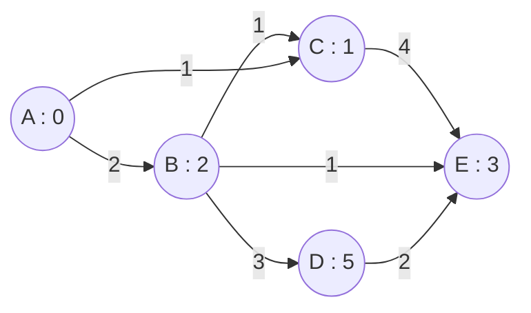
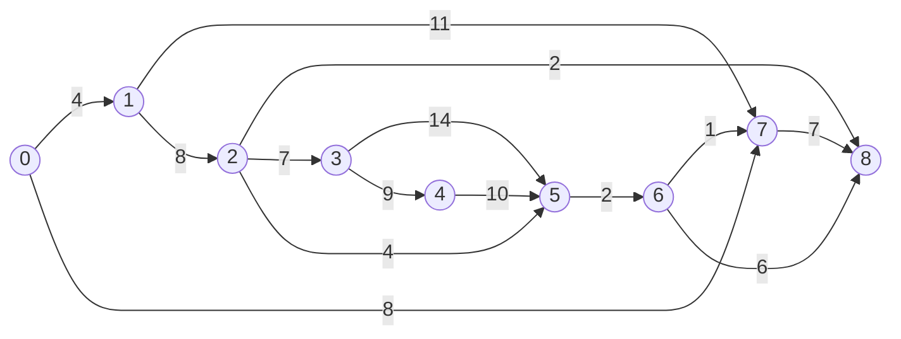
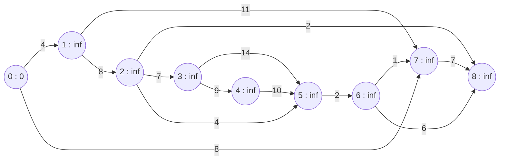
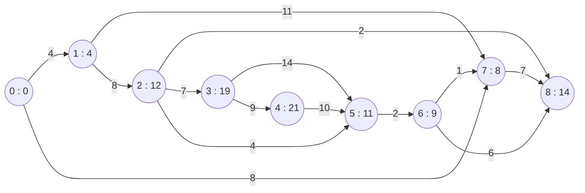

# Greedy Paradigm

Greedy paradigm is a paradigm in which we make the locally optimal choice at each step with the hope of finding the global optimum.

## Components of Greedy Algorithm

- **Candidate Set**: Set of all the candidates that can be used to construct a solution.
  $$
  C = \{c_1, c_2, c_3, \dots, c_n\}
  $$
- **Selection Function**: Function that selects the best candidate to be added to the solution.
  $$
  G(C) = c_i
  $$
- **Feasibility Function**: Function that checks if the candidate can be used to contribute to the solution.
  $$
  F(c_i) = \{True, False\}
  $$
- **Objective Function**: Function that assigns a value to the solution or a partial solution.
  $$
  V(c_i) = \{v_1, v_2, v_3, \dots, v_n\}
  $$
- **Solution Function**: Function that checks if the solution is complete.
  $$
  S(c_i) = \{True, False\}
  $$

### Candidate Set

The candidate set is the set of all the candidates that can be used to construct a solution. For example, if we are trying to find the minimum number of coins required to make a given amount, then the candidate set would be the set of all the coins available to us.

### Selection Function

The selection function is the function that selects the best candidate to be added to the solution. For example, if we are trying to find the minimum number of coins required to make a given amount, then the selection function would be the function that selects the coin with the highest value that is less than the given amount.

```py
def selection_function(candidates):
    return max(candidates)
```

### Feasibility Function

The feasibility function is the function that checks if the candidate can be used to contribute to the solution. For example, if we are trying to find the minimum number of coins required to make a given amount, then the feasibility function would be the function that checks if the coin is less than the given amount.

```py
def feasibility_function(candidate, amount):
    return candidate <= amount
```

### Objective Function

The objective function is the function that assigns a value to the solution or a partial solution. For example, if we are trying to find the minimum number of coins required to make a given amount, then the objective function would be the function that assigns the value of the coin to the solution.

```py
def objective_function(candidate):
    return candidate
```

### Solution Function

The solution function is the function that checks if the solution is complete. For example, if we are trying to find the minimum number of coins required to make a given amount, then the solution function would be the function that checks if the amount is zero.

```py
def solution_function(amount):
    return amount == 0
```

## Failures of Greedy Algorithm

- **Coin Change Problem**: The coin change problem is the problem of finding the minimum number of coins required to make a given amount. The greedy algorithm fails for the coin change problem if the coins are not in the descending order of their values.
- **Activity Selection Problem**: The activity selection problem is the problem of finding the maximum number of activities that can be performed given the start and end times of the activities. The greedy algorithm fails for the activity selection problem if the activities are not sorted in the ascending order of their end times.
- **Fractional Knapsack Problem**: The fractional knapsack problem is the problem of finding the maximum value of items that can be put in a knapsack given the weights and values of the items. The greedy algorithm fails for the fractional knapsack problem if the items are not sorted in the descending order of their value to weight ratio.
- **Job Sequencing Problem**: The job sequencing problem is the problem of finding the maximum profit that can be made by performing the jobs given the profits and deadlines of the jobs. The greedy algorithm fails for the job sequencing problem if the jobs are not sorted in the descending order of their profits.
- **Huffman Coding**: Huffman coding is the problem of finding the minimum number of bits required to encode a given string. The greedy algorithm fails for the Huffman coding problem if the characters are not sorted in the ascending order of their frequencies.
- **Minimum Spanning Tree**: The minimum spanning tree problem is the problem of finding the minimum cost tree that connects all the nodes in a graph. The greedy algorithm fails for the minimum spanning tree problem if the graph is not connected.

## Algorithms based on Greedy Paradigm

- **Prim's Minimum Spanning Tree Algorithm**: Prim's minimum spanning tree algorithm is the algorithm that finds the minimum cost tree that connects all the nodes in a graph. The algorithm is based on the greedy paradigm.
- **Kruskal's Minimum Spanning Tree Algorithm**: Kruskal's minimum spanning tree algorithm is the algorithm that finds the minimum cost tree that connects all the nodes in a graph. The algorithm is based on the greedy paradigm.
- **Dijkstra's Shortest Path Algorithm**: Dijkstra's shortest path algorithm is the algorithm that finds the shortest path from a source node to all the other nodes in a graph. The algorithm is based on the greedy paradigm.

### Prim's Minimum Spanning Tree Algorithm

Prim's minimum spanning tree algorithm is the algorithm that finds the minimum cost tree that connects all the nodes in a graph. The algorithm is based on the greedy paradigm.

$$
\begin{aligned}
&\text{Input: } G = (V, E) \\
&\text{Output: } T = (V, E') \text{ where } E' \subseteq E \text{ and } T \text{ is a minimum spanning tree of } G \\\\
&\text{Let } T = (V, \emptyset) \\
&\text{Let } S = \{v_1\} \\
&\text{while } S \neq V \\
&\qquad \text{Let } e = (u, v) \text{ be the minimum cost edge such that } u \in S \text{ and } v \notin S \\
&\qquad \text{Add } e \text{ to } T \\
&\qquad \text{Add } v \text{ to } S \\
&\text{end while} \\
&\text{return } T
\end{aligned}
$$

```py
class Graph:
    def __init__(self, vertices: List[int], edges: List[Tuple[int, int, int]]):
        self.vertices = vertices
        self.edges = edges

    def add_vertex(self, vertex: int):
        self.vertices.append(vertex)

    def add_edge(self, edge: Tuple[int, int, int]):
        self.edges.append(edge)


def prim(G: Graph) -> Graph:
  T = Graph(G.vertices, [])
  S = [G.vertices[0]]

  while len(S) != len(G.vertices):
    e = min(
      filter(lambda edge: edge[0] in S and edge[1] not in S, G.edges),
      key=lambda edge: edge[2],
    )
    T.add_edge(e)
    S.append(e[1])

  return T
```

Time Complexity: $O(|V|^2)$

Space Complexity: $O(|V| + |E|)$


### Kruskal's Minimum Spanning Tree Algorithm

Kruskal's minimum spanning tree algorithm is the algorithm that finds the minimum cost tree that connects all the nodes in a graph. The algorithm is based on the greedy paradigm.

$$
\begin{aligned}
&\text{Input: } G = (V, E) \\
&\text{Output: } T = (V, E') \text{ where } E' \subseteq E \text{ and } T \text{ is a minimum spanning tree of } G \\\\
&\text{Let } T = (V, \emptyset) \\
&\text{Sort } E \text{ in the ascending order of their costs} \\
&\text{for each } e \in E \\
&\qquad \text{if } T \cup \{e\} \text{ does not contain a cycle} \\
&\qquad \qquad \text{Add } e \text{ to } T \\
&\qquad \text{end if} \\
&\text{end for} \\
&\text{return } T
\end{aligned}
$$

```py
class Graph:
  def __init__(self, vertices: List[int], edges: List[Tuple[int, int, int]]):
    self.vertices = vertices
    self.edges = edges

  def add_vertex(self, vertex: int):
    self.vertices.append(vertex)

  def add_edge(self, edge: Tuple[int, int, int]):
    self.edges.append(edge)

def kruskal(G: Graph) -> Graph:
  T = Graph(G.vertices, [])
  S = {vertex: vertex for vertex in G.vertices}

  for edge in sorted(G.edges, key=lambda edge: edge[2]):
    if S[edge[0]] != S[edge[1]]:
      T.add_edge(edge)
      S = {vertex: S[edge[0]] if S[vertex] == S[edge[1]] else S[vertex] for vertex in G.vertices}

  return T
```

Time Complexity: $O(|E| \log |E|)$

Space Complexity: $O(|V| + |E|)$

### Dijkstra's Shortest Path Algorithm

Dijkstra's shortest path algorithm is the algorithm that finds the shortest path from a source node to all the other nodes in a graph. The algorithm is based on the greedy paradigm.

$$
\begin{aligned}
&\text{Input: } G = (V, E), s \in V \\
&\text{Output: } d = \{d_1, d_2, d_3, \dots, d_n\} \text{ where } d_i \text{ is the shortest distance from } s \text{ to } v_i \\\\
&\text{Let } d = \{0, \infty, \infty, \dots, \infty\} \\
&\text{Let } S = \{s\} \\
&\text{while } S \neq V \\
&\qquad \text{Let } v \in V \setminus S \text{ such that } d_v \text{ is minimum} \\
&\qquad \text{Add } v \text{ to } S \\
&\qquad \text{for each } u \in V \setminus S \\
&\qquad \qquad \text{if } d_v + w(v, u) < d_u \\
&\qquad \qquad \qquad d_u = d_v + w(v, u) \\
&\qquad \qquad \text{end if} \\
&\qquad \text{end for} \\
&\text{end while} \\
&\text{return } d
\end{aligned}
$$

```py
class Graph:
  def __init__(self, vertices: List[int], edges: List[Tuple[int, int, int]]):
    self.vertices = vertices
    self.edges = edges

  def add_vertex(self, vertex: int):
    self.vertices.append(vertex)

  def add_edge(self, edge: Tuple[int, int, int]):
    self.edges.append(edge)

def dijkstra(G: Graph, s: int) -> List[int]:
  d = [0] + [float("inf")] * (len(G.vertices) - 1)
  S = [s]

  while len(S) != len(G.vertices):
    v = min(
      filter(lambda vertex: vertex not in S, G.vertices),
      key=lambda vertex: d[vertex],
    )
    S.append(v)
    for u in filter(lambda vertex: vertex not in S, G.vertices):
      if d[v] + G.edges[(v, u)] < d[u]:
        d[u] = d[v] + G.edges[(v, u)]

  return d
```

Time Complexity: $O(|V|^2)$

Space Complexity: $O(|V| + |E|)$

## 


## Travelling Salesman Problem

The travelling salesman problem is the problem of finding the minimum cost tour that visits all the nodes in a graph. The problem is NP-hard.

### Brute Force Algorithm

The brute force algorithm is the algorithm that finds the minimum cost tour that visits all the nodes in a graph. The algorithm is based on the brute force paradigm.

$$
\begin{aligned}
&\text{Input: } G = (V, E) \\
&\text{Output: } T = (V, E') \text{ where } E' \subseteq E \text{ and } T \text{ is a minimum cost tour of } G \\\\
&\text{Let } T = (V, \emptyset) \\
&\text{for each permutation } P \text{ of } V \\
&\qquad \text{Let } T' = (V, \emptyset) \\
&\qquad \text{for each } (u, v) \in P \\
&\qquad \qquad \text{Add } (u, v) \text{ to } T' \\
&\qquad \qquad \text{if } T' \text{ contains a cycle} \\
&\qquad \qquad \qquad \text{Remove } (u, v) \text{ from } T' \\
&\qquad \qquad \text{end if} \\
&\qquad \text{end for} \\
&\qquad \text{if } T' \text{ is a tour} \\
&\qquad \qquad \text{if } T' \text{ is a minimum cost tour} \\
&\qquad \qquad \qquad \text{Let } T = T' \\
&\qquad \qquad \text{end if} \\
&\qquad \text{end if} \\
&\text{end for} \\
&\text{return } T
\end{aligned}
$$

```py
class Graph:
  def __init__(self, vertices: List[int], edges: List[Tuple[int, int, int]]):
    self.vertices = vertices
    self.edges = edges

  def add_vertex(self, vertex: int):
    self.vertices.append(vertex)

  def add_edge(self, edge: Tuple[int, int, int]):
    self.edges.append(edge)

def brute_force(G: Graph) -> Graph:
  T = Graph(G.vertices, [])
  for P in permutations(G.vertices):
    T_ = Graph(G.vertices, [])
    for i in range(len(P)):
      T_.add_edge((P[i], P[(i + 1) % len(P)]))
      if T_.contains_cycle():
        T_.remove_edge((P[i], P[(i + 1) % len(P)]))
    if T_.is_tour():
      if T_.cost() < T.cost():
        T = T_
  return T
```

Time Complexity: $O(|V|!)$

Space Complexity: $O(|V| + |E|)$

### Dynamic Programming Algorithm

The dynamic programming algorithm is the algorithm that finds the minimum cost tour that visits all the nodes in a graph. The algorithm is based on the dynamic programming paradigm.

$$
\begin{aligned}
&\text{Input: } G = (V, E) \\
&\text{Output: } T = (V, E') \text{ where } E' \subseteq E \text{ and } T \text{ is a minimum cost tour of } G \\\\
&\text{Let } T = (V, \emptyset) \\
&\text{for each } v \in V \\
&\qquad \text{Let } T' = (V, \emptyset) \\
&\qquad \text{for each } u \in V \setminus \{v\} \\
&\qquad \qquad \text{Add } (u, v) \text{ to } T' \\
&\qquad \qquad \text{if } T' \text{ contains a cycle} \\
&\qquad \qquad \qquad \text{Remove } (u, v) \text{ from } T' \\
&\qquad \qquad \text{end if} \\
&\qquad \text{end for} \\
&\qquad \text{if } T' \text{ is a tour} \\
&\qquad \qquad \text{if } T' \text{ is a minimum cost tour} \\
&\qquad \qquad \qquad \text{Let } T = T' \\
&\qquad \qquad \text{end if} \\
&\qquad \text{end if} \\
&\text{end for} \\
&\text{return } T
\end{aligned}
$$

```py
class Graph:
  def __init__(self, vertices: List[int], edges: List[Tuple[int, int, int]]):
    self.vertices = vertices
    self.edges = edges

  def add_vertex(self, vertex: int):
    self.vertices.append(vertex)

  def add_edge(self, edge: Tuple[int, int, int]):
    self.edges.append(edge)

def dynamic_programming(G: Graph) -> Graph:
  T = Graph(G.vertices, [])
  for v in G.vertices:
    T_ = Graph(G.vertices, [])
    for u in G.vertices:
      if u != v:
        T_.add_edge((u, v))
        if T_.contains_cycle():
          T_.remove_edge((u, v))
    if T_.is_tour():
      if T_.cost() < T.cost():
        T = T_
  return T
```

Time Complexity: $O(|V|^2)$

Space Complexity: $O(|V| + |E|)$

### Branch and Bound Algorithm

The branch and bound algorithm is the algorithm that finds the minimum cost tour that visits all the nodes in a graph. The algorithm is based on the branch and bound paradigm.

$$
\begin{aligned}
&\text{Input: } G = (V, E) \\
&\text{Output: } T = (V, E') \text{ where } E' \subseteq E \text{ and } T \text{ is a minimum cost tour of } G \\\\
&\text{Let } T = (V, \emptyset) \\
&\text{for each } v \in V \\
&\qquad \text{Let } T' = (V, \emptyset) \\
&\qquad \text{for each } u \in V \setminus \{v\} \\
&\qquad \qquad \text{Add } (u, v) \text{ to } T' \\
&\qquad \qquad \text{if } T' \text{ contains a cycle} \\
&\qquad \qquad \qquad \text{Remove } (u, v) \text{ from } T' \\
&\qquad \qquad \text{end if} \\
&\qquad \text{end for} \\
&\qquad \text{if } T' \text{ is a tour} \\
&\qquad \qquad \text{if } T' \text{ is a minimum cost tour} \\
&\qquad \qquad \qquad \text{Let } T = T' \\
&\qquad \qquad \text{end if} \\
&\qquad \text{end if} \\
&\text{end for} \\
&\text{return } T
\end{aligned}
$$

```py
class Graph:
  def __init__(self, vertices: List[int], edges: List[Tuple[int, int, int]]):
    self.vertices = vertices
    self.edges = edges

  def add_vertex(self, vertex: int):
    self.vertices.append(vertex)

  def add_edge(self, edge: Tuple[int, int, int]):
    self.edges.append(edge)

def branch_and_bound(G: Graph) -> Graph:
  T = Graph(G.vertices, [])
  for v in G.vertices:
    T_ = Graph(G.vertices, [])
    for u in G.vertices:
      if u != v:
        T_.add_edge((u, v))
        if T_.contains_cycle():
          T_.remove_edge((u, v))
    if T_.is_tour():
      if T_.cost() < T.cost():
        T = T_
  return T
```

Time Complexity: $O(|V|^2)$

Space Complexity: $O(|V| + |E|)$

## Edge Relaxation

Edge relaxation is the process of updating the distance of a node from the source node using the distance of the node from the source node and the weight of the edge between the node and the source node.

Example:



1. Initially, the distance of all the nodes from the source node is infinity.



2. Update the distance of the nodes from the source node using the distance of the nodes from the source node and the weight of the edges between the nodes and the source node.

- Distance of B from the source node is 2.
- Distance of C from the source node is 1.
- Distance of D from the source node is 5.
- Distance of E from the source node is 3.



Example:



1. Initially, the distance of all the nodes from the source node is infinity.



2. Update the distance of the nodes from the source node using the distance of the nodes from the source node and the weight of the edges between the nodes and the source node.

- Distance of 1 from the source node is 4.
- Distance of 7 from the source node is 8.
- Distance of 2 from the source node is 12.
- Distance of 3 from the source node is 19.
- Distance of 4 from the source node is 21.
- Distance of 5 from the source node is 11.
- Distance of 6 from the source node is 9.
- Distance of 8 from the source node is 14.



Minimum spanning tree is 0 -> 1 -> 7 -> 6 -> 8 -> 2 -> 5 -> 3 -> 4.
Sum of the weights of the edges in the minimum spanning tree is 4 + 11 + 9 + 2 + 4 + 2 + 4 + 7 = 43.
