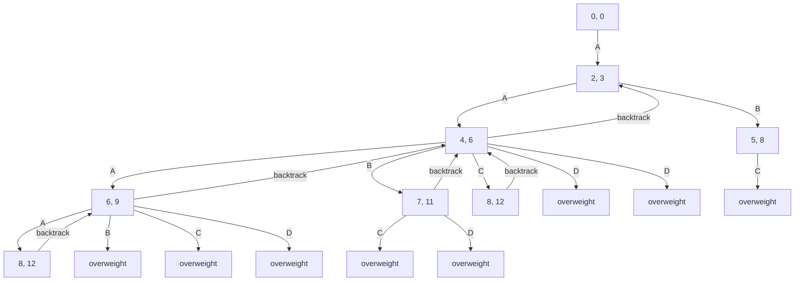
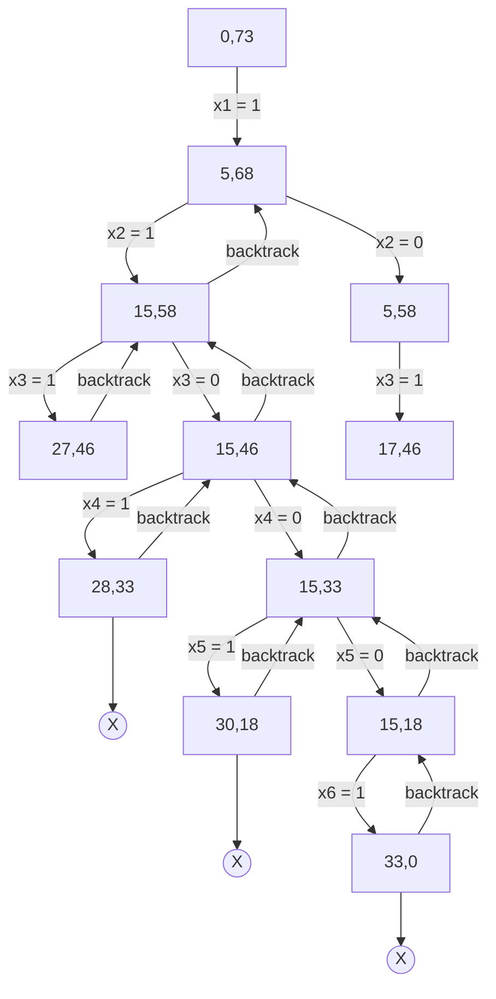

# Knapsack

Knapsack problem is a problem in combinatorial optimization: Given a set of items, each with a weight and a value, determine the number of each item to include in a collection so that the total weight is less than or equal to a given limit and the total value is as large as possible.

## Fractional Knapsack

Fractional knapsack problem is a problem in combinatorial optimization: Given a set of items, each with a weight and a value, determine the number of each item to include in a collection so that the total weight is less than or equal to a given limit and the total value is as large as possible.

$$
\begin{aligned}
  \text{maximize} \qquad & \sum_{i=1}^n p_i x_i \\
  \text{subject to} \qquad & \sum_{i=1}^n w_i x_i \leq W \\
  & x_i \in \{0, 1\} \qquad \forall i \in \{1, 2, ..., n\}
\end{aligned}
$$

Solution:

Given:

| Item   | A   | B   | C   | D   |
| ------ | --- | --- | --- | --- |
| Profit | 280 | 100 | 120 | 120 |
| Weight | 40  | 10  | 20  | 24  |
| Ratio  | 7   | 10  | 6   | 5   |

- Sort items by ratio in descending order

| Item   | B   | A   | C   | D   |
| ------ | --- | --- | --- | --- |
| Profit | 100 | 280 | 120 | 120 |
| Weight | 10  | 40  | 20  | 24  |
| Ratio  | 10  | 7   | 6   | 5   |

- Take as much of the highest ratio item as possible

  - First all of B is chosen
    Weight left: 60 - 10 = 50
    Profit: 0 + 100 = 100

  - Then A is chosen
    Weight left: 50 - 40 = 10
    Profit: 100 + 280 = 380

  - Then C is chosen
    Weight left: 10 - (20 _ 10/20) = 0
    Profit: 380 + (120 _ 10/20) = 380 + 60 = 440

Time complexity: O(n log n)

#### Practice problems 1

Consider the following instance of the knapsack problem:
n = 3, M = 20, V = [24, 25, 15], W = [18, 15, 20]
Find the optimal solution to this instance of the knapsack problem.

Solution:

| Item   | A   | B   | C    |
| ------ | --- | --- | ---- |
| Profit | 24  | 25  | 15   |
| Weight | 18  | 15  | 20   |
| Ratio  | 1.3 | 1.6 | 0.75 |

- Sort items by ratio in descending order

| Item   | B   | A   | C    |
| ------ | --- | --- | ---- |
| Profit | 25  | 24  | 15   |
| Weight | 15  | 18  | 20   |
| Ratio  | 1.6 | 1.3 | 0.75 |

- Take as much of the highest ratio item as possible

  - First all of B is chosen
    Weight left: 20 - 15 = 5
    Profit: 0 + 25 = 25

  - Then A is chosen
    Weight left: 5 - (18 _ 5/18) = 0
    Profit: 25 + (24 _ 5/18) = 25 + 6.67 = 31.67

Algorithm:

```c
Item {
  int p;
  int w;
  float r;
}
Knapsack(Item[], M) {
  Sort(Item[], ->r);

  for (int i = 0; i < Item.length; i++) {
    if (Item[i]->w <= M) {
      M -= Item[i]->w;
      profit += Item[i]->p;
    } else {
      profit += Item[i]->p * M / Item[i]->w;
      break;
    }
  }
}
```

## 0/1 Knapsack with Backtracking

Given a set of items, each with a weight and a value, determine the number of each item to include in a collection so that the total weight is less than or equal to a given limit and the total value is as large as possible.

$$
\begin{aligned}
  \text{maximize} \qquad & \sum_{i=1}^n p_i x_i \\
  \text{subject to} \qquad & \sum_{i=1}^n w_i x_i \leq W \\
  & x_i \in \{0, 1\} \qquad \forall i \in \{1, 2, ..., n\}
\end{aligned}
$$

Solution:

Given:

Max Weight: 8

| Item   | A   | B   | C   | D   |
| ------ | --- | --- | --- | --- |
| Profit | 2   | 3   | 4   | 5   |
| Weight | 3   | 5   | 6   | 10  |



## Sum of subset problem with Backtracking

Given a set of non-negative integers, and a value sum, determine if there is a subset of the given set with sum equal to given sum.

Example:

$$
w{1,6} = {5,10,12,13,15,18}
n = 6
m = 30
$$



### Algorithm:

```cpp
#include <iostream>

using namespace std;

int w[] = {5, 10, 12, 13, 15, 18};
int n = 6;
int m = 30;
int x[6] = {0, 0, 0, 0, 0, 0};

void sum_of_subset(int s, int k, int r) {
  x[k] = 1;
  if (s + w[k] == m) {
    for (int i = 0; i < n; i++) {
      cout << x[i] << " ";
    }
    cout << endl;
  } else if (s + w[k] + w[k + 1] <= m) {
    sum_of_subset(s + w[k], k + 1, r - w[k]);
  }
  if ((s + r - w[k] >= m) && (s + w[k + 1] <= m)) {
    x[k] = 0;
    sum_of_subset(s, k + 1, r - w[k]);
  }
}

int main() {
  int sum = 0;
  for (int i = 0; i < n; i++) {
    sum += w[i];
  }
  sum_of_subset(0, 0, sum);
  return 0;
}
```