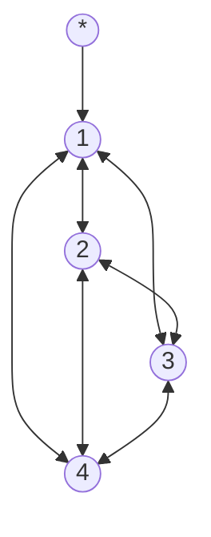

# Traveling Salesman Problem

The traveling salesman problem is a classic problem in computer science. It is an NP-hard problem in combinatorial optimization. The problem is to find the shortest path that visits every vertex exactly once. The problem is NP-hard because there is no known polynomial time algorithm that can solve the problem. The best known algorithm is the Held-Karp algorithm which runs in $O(n^2 * 2^n)$ time.

#### Example

$$
g(i, s) = \min_{k \in s, k \neq i} \{ C_{i,k} + g(k, s - \{k\}) \}
$$

$$
\begin{aligned}
C = \begin{bmatrix}
    0 & 10 & 15 & 20 \\
    5 & 0 & 9 & 10 \\
    6 & 13 & 0 & 12 \\
    8 & 8 & 9 & 0 \\
    \end{bmatrix}
\end{aligned}
$$

$$
\begin{aligned}
g(1, \{2, 3, 4\}) &= \min_{k \in \{2, 3, 4\}, k \neq 1} \{ C_{1,k} + g(k, \{2, 3, 4\} - \{k\}) \} \\
&= \min_{} \begin{cases}
    C_{1,2} + g(2, \{3, 4\}) \\
    C_{1,3} + g(3, \{2, 4\}) \\
    C_{1,4} + g(4, \{2, 3\}) \\
\end{cases} \\

&= \min_{} \begin{cases}
    10 + g(2, \{3, 4\}) \\
    15 + g(3, \{2, 4\}) \\
    20 + g(4, \{2, 3\}) \\
\end{cases} \\

&= \min_{} \begin{cases}
  10 + \min_{k \in \{3, 4\}, k \neq 2} \{ C_{2,k} + g(k, \{3, 4\} - \{k\}) \} \\
  15 + \min_{k \in \{2, 4\}, k \neq 3} \{ C_{3,k} + g(k, \{2, 4\} - \{k\}) \} \\
  20 + \min_{k \in \{2, 3\}, k \neq 4} \{ C_{4,k} + g(k, \{2, 3\} - \{k\}) \} \\
\end{cases} \\

&= \min_{} \begin{cases}
  10 + \min_{} \begin{cases}
    C_{2,3} + g(3, \{4\}) \\
    C_{2,4} + g(4, \{3\}) \\
  \end{cases} \\
  15 + \min_{} \begin{cases}
    C_{3,2} + g(2, \{4\}) \\
    C_{3,4} + g(4, \{2\}) \\
  \end{cases} \\
  20 + \min_{} \begin{cases}
    C_{4,2} + g(2, \{3\}) \\
    C_{4,3} + g(3, \{2\}) \\
  \end{cases} \\
\end{cases} \\

&= \min_{} \begin{cases}
  10 + \min_{} \begin{cases}
    9 &+ \quad g(3, \{4\}) \\
    10 &+ \quad g(4, \{3\}) \\
  \end{cases} \\
  15 + \min_{} \begin{cases}
    5 &+ \quad g(2, \{4\}) \\
    12 &+ \quad g(4, \{2\}) \\
  \end{cases} \\
  20 + \min_{} \begin{cases}
    6 &+ \quad g(2, \{3\}) \\
    13 &+ \quad g(3, \{2\}) \\
  \end{cases} \\
\end{cases} \\

&= \min_{} \begin{cases}
  10 + \min_{} \begin{cases}
    9 &+ \quad \min_{k \in \{4\}, k \neq 3} \{ C_{3,k} + g(k, \{4\} - \{k\}) \} \\
    10 &+ \quad \min_{k \in \{3\}, k \neq 4} \{ C_{4,k} + g(k, \{3\} - \{k\}) \} \\
  \end{cases} \\
  15 + \min_{} \begin{cases}
    5 &+ \quad \min_{k \in \{4\}, k \neq 2} \{ C_{2,k} + g(k, \{4\} - \{k\}) \} \\
    12 &+ \quad \min_{k \in \{2\}, k \neq 4} \{ C_{4,k} + g(k, \{2\} - \{k\}) \} \\
  \end{cases} \\
  20 + \min_{} \begin{cases}
    6 &+ \quad \min_{k \in \{3\}, k \neq 2} \{ C_{2,k} + g(k, \{3\} - \{k\}) \} \\
    13 &+ \quad \min_{k \in \{2\}, k \neq 3} \{ C_{3,k} + g(k, \{2\} - \{k\}) \} \\
  \end{cases} \\
\end{cases} \\

&= \min_{} \begin{cases}
  10 + \min_{} \begin{cases}
    9 &+ \quad \min_{} \begin{cases}
      C_{3,4} + g(4, \phi) \\
    \end{cases} \\
    10 &+ \quad \min_{} \begin{cases}
      C_{4,3} + g(3, \phi) \\
    \end{cases} \\
  \end{cases} \\
  15 + \min_{} \begin{cases}
    5 &+ \quad \min_{} \begin{cases}
      C_{2,4} + g(4, \phi) \\
    \end{cases} \\
    12 &+ \quad \min_{} \begin{cases}
      C_{4,2} + g(2, \phi) \\
    \end{cases} \\
  \end{cases} \\
  20 + \min_{} \begin{cases}
    6 &+ \quad \min_{} \begin{cases}
      C_{2,3} + g(3, \phi) \\
    \end{cases} \\
    13 &+ \quad \min_{} \begin{cases}
      C_{3,2} + g(2, \phi) \\
    \end{cases} \\
  \end{cases} \\
\end{cases} \\

&= \min_{} \begin{cases}
  10 + \min_{} \begin{cases}
    9 &+ \quad \min_{} \{12 + g(4, \phi) \} \\
    10 &+ \quad \min_{} \{8 + g(3, \phi) \} \\
  \end{cases} \\
  15 + \min_{} \begin{cases}
    5 &+ \quad \min_{} \{20 + g(4, \phi) \} \\
    12 &+ \quad \min_{} \{8 + g(2, \phi) \} \\
  \end{cases} \\
  20 + \min_{} \begin{cases}
    6 &+ \quad \min_{} \{15 + g(3, \phi) \} \\
    13 &+ \quad \min_{} \{5 + g(2, \phi) \} \\
  \end{cases} \\
\end{cases} \\

&= \min_{} \begin{cases}
  10 + \min_{} \begin{cases}
    9 &+ \quad \min_{} \{12 + 0 \} \\
    10 &+ \quad \min_{} \{8 + 0 \} \\
  \end{cases} \\
  15 + \min_{} \begin{cases}
    5 &+ \quad \min_{} \{20 + 0 \} \\
    12 &+ \quad \min_{} \{8 + 0 \} \\
  \end{cases} \\
  20 + \min_{} \begin{cases}
    6 &+ \quad \min_{} \{15 + 0 \} \\
    13 &+ \quad \min_{} \{5 + 0 \} \\
  \end{cases} \\
\end{cases} \\

&= \min_{} \begin{cases}
  10 + \min_{} \begin{cases}
    9 &+ \quad \min_{} \{12 \} \\
    10 &+ \quad \min_{} \{8 \} \\
  \end{cases} \\
  15 + \min_{} \begin{cases}
    5 &+ \quad \min_{} \{20 \} \\
    12 &+ \quad \min_{} \{8 \} \\
  \end{cases} \\
  20 + \min_{} \begin{cases}
    6 &+ \quad \min_{} \{15 \} \\
    13 &+ \quad \min_{} \{5 \} \\
  \end{cases} \\
\end{cases} \\

&= \min_{} \begin{cases}
  10 + \min_{} \begin{cases}
    9 &+ \quad 12 \\
    10 &+ \quad 8 \\
  \end{cases} \\
  15 + \min_{} \begin{cases}
    5 &+ \quad 20 \\
    12 &+ \quad 8 \\
  \end{cases} \\
  20 + \min_{} \begin{cases}
    6 &+ \quad 15 \\
    13 &+ \quad 5 \\
  \end{cases} \\
\end{cases} \\

&= \min_{} \begin{cases}
  10 + \min_{} \{21, 18\} \\
  15 + \min_{} \{25, 20\} \\
  20 + \min_{} \{21, 18\} \\
\end{cases} \\

&= \min_{} \begin{cases}
  10 + 18 \\
  15 + 20 \\
  20 + 18 \\
\end{cases} \\

&= \min_{} \{28, 35, 38\} \\

&= 28 \\

\end{aligned}
$$
